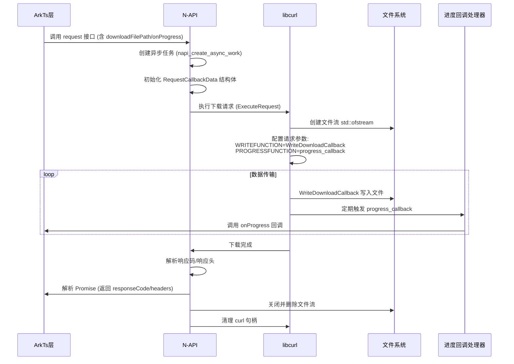
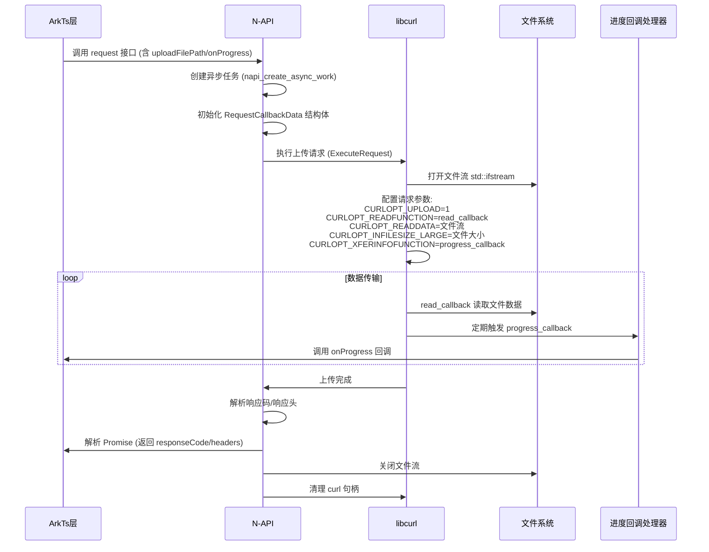

# gmcurl HTTP Client Module

## 模块简介

本模块基于 libcurl 提供跨平台的 HTTP/HTTPS 请求支持，完整实现 TLS/SSL 及国密算法协议通信。支持异步 Promise 编程模型，适用于
HarmonyOS 应用开发。

## 仓库地址
[GMHTTP-HarmonyOS](https://github.com/chenchl/GMHTTP-HarmonyOS)

## 功能特性

- 支持 GET/POST/PUT/DELETE HTTP 方法
- 支持 String/JSON/multipart-form-data/ArrayBuffer 多种数据格式
- 完整支持 SSL/TLS 及国密协议（TLCP），支持单/双向证书认证
- 支持Accept-Encoding压缩(gzip、deflate算法)
- 提供异步 Promise 模式编程接口
- 支持详细的调试日志输出
- 自动响应头解析和错误处理
- 支持multipart/form-data表单上传/文件下载（断点下载）
- 支持上传/下载进度监听（1秒间隔或完成时触发）
- 支持性能指标监控，便于分析请求耗时和网络状态
- 整体接口设计/使用流程和harmonyOS官方Http模块基本保持一致，便于开发者快速上手。

## 快速开始

### 安装依赖

#### 1. 同步依赖

```bash
ohpm install @chenchl/gmcurl
```

#### 2. 混淆规则（可选）

- 如果希望gmcurl库在代码混淆过程中不会被混淆，需要在混淆规则配置文件obfuscation-rules.txt中添加相应的排除规则：

```
-keep
./oh_modules/@chenchl/gmcurl
```

### 基础示例

```typescript
// 导入模块
import GMHttp from '@chenchl/gmcurl';

// 发起 GET 请求
GMHttp.request({
  url: 'https://example.com',
  method: 'GET',
  requestID: 1001, 
  headers: {
     'Content-Type': 'application/json',
     'Accept-Encoding': 'gzip, deflate',
     'Authorization': 'Bearer <token>',
     'User-Agent': 'GMCurl/1.0'
  },//请求头,类型为key-value对
}).then((response: GMHttp.HttpResponse) => {
  console.log(`Status Code: ${response.responseCode}`);
  console.log(`Response Body: ${response.body}`);
}).catch((error: GMHttp.HttpResponseError) => {
  console.error(`Request failed: ${error.message}`);
});

// 发起 POST 请求
GMHttp.request({
   url: 'https://example.com',
   method: 'POST',
   extraData: {
      name: 'John Doe',
      age: 30
   }, //  请求体数据, 支持String/JSON/ArrayBuffer/
   headers: {
      'Content-Type': 'application/json',
      'Accept-Encoding': 'gzip, deflate',
      'Authorization': 'Bearer <token>',
      'User-Agent': 'GMCurl/1.0'
   },//请求头,类型为key-value对
   requestID: 1001,//请求ID 用于取消请求
}).then((response: GMHttp.HttpResponse) => {
   console.log(`Status Code: ${response.responseCode}`);
   console.log(`Response Body: ${response.body}`);
}).catch((error: GMHttp.HttpResponseError) => {
   console.error(`Request failed: ${error.message}`);
});

//取消请求
GMHttp.cancelRequest(requestId);

```

## API 文档

### 类型定义

```typescript
// HTTP方法枚举
export type HttpMethod = 'GET' | 'POST' | 'PUT' | 'DELETE';

// 请求头接口
export type HttpHeaders = { [key: string]: string; };

// 进度回调方法
export type ProgressCallback = (currentSize: number, totalSize: number) => void;
```

### 请求选项

```typescript
// 请求选项接口
export interface HttpRequestOptions {
   url: string; // 请求URL
   method?: HttpMethod; // HTTP方法
   extraData?: any; // 请求体数据
   headers?: HttpHeaders; // 请求头
   readTimeout?: number; // 读取超时时间（秒）
   connectTimeout?: number; // 连接超时时间（秒）
   caPath?: string; // CA证书路径
   clientCertPath?: string; // 客户端证书路径
   isTLCP?: boolean; // 是否使用国密协议（默认：false）
   verifyServer?: boolean; // 是否验证服务端（默认：true）
   debug?: boolean; // 调试模式（默认：false）
   requestID?: number; // 请求ID
   multiFormDataList?: MultiFormData[]; // 表单数据列表
   downloadFilePath?: string; // 下载文件路径
   uploadFilePath?: string; //  上传文件路径
   onProgress?: ProgressCallback; // 进度回调
   performanceTiming?: boolean; // 是否开启性能指标监控（默认：false）
}

// 多部分表单数据接口
export interface MultiFormData {
   name: string; // 字段名
   filePath?: string; // 文件路径
   remoteFileName?: string; // 远程文件名
   contentType: string; // 文件类型
   data?: string | Object | ArrayBuffer; // 数据
}
```

### 响应格式

```typescript
// 响应格式
export interface HttpResponse {
   responseCode: number; // 状态码
   headers: HttpHeaders; // 响应头
   body: string | ArrayBuffer; // 响应体
   performanceTiming?:  PerformanceTiming; // 性能指标
}

// 错误格式
export interface HttpResponseError {
   code: number; //错误码
   message: string; //错误信息
}

//  性能指标接口
export interface PerformanceTiming {
   dnsTiming: number; // 从request请求到DNS解析完成耗时
   tcpTiming: number; // 从request请求到TCP连接完成耗时
   tlsTiming: number; // 从request请求到TLS连接完成耗时
   firstSendTiming: number; //  从request请求到发送数据包完成耗时
   firstReceiveTiming: number; // 从request请求到接收到响应包完成耗时
   totalFinishTiming: number; // 从request请求到响应完成耗时
   redirectTiming: number; // 重定向耗时
   totalTiming: number;// 总耗时
}
```

#### 错误码说明

| 错误码    | 含义说明                                                                          |
|--------|-------------------------------------------------------------------------------|
| 0-1000 | libcurl 标准错误码（参考[curl-errors](https://curl.se/libcurl/c/libcurl-errors.html)） |
| 2000+  | 内部异常（如内存溢出、参数解析失败等）                                                           |
| 101    | 文件操作失败（下载/上传路径无效/权限不足）                                                        |
| 102    | cURL 初始化失败                                                                    |
| 103    | 请求被用户主动取消                                                                     |
| 104    | 不支持的请求方法                                                                      |
| 105    | 请求超时（包含连接超时和读取超时）                                                             |
| 106    | SSL/TLS 握手失败                                                                  |
| 107    | CA 证书验证失败                                                                     |
| 108    | 客户端证书加载失败                                                                     |
| 109    | 不完整的表单数据                                                                      |
| 110    | 文件上传失败（文件路径无效/权限不足）                                                           |
| 111    | 不支持的 Content-Type 类型                                                          |

> 注意：当 `code` 值大于 1000 时为gmcurl库自定义错误码，小于 1000 的值为 libcurl 原始错误码

## 使用示例

### 文件下载与进度监控

```typescript
GMHttp.request({
  url: "https://download.example.com/api",
  method: 'GET',
  downloadFilePath: this.downloadPath + `test.png`,
  onProgress: (current, total) => {
    let percent = Math.floor(current * 100 / total);
    console.log(`Download progress: ${percent}% [${current}/${total}]`);
  },
});
```

### 文件上传与进度监控

```typescript
GMHttp.request({
  url: "https://download.example.com/api",
  method: 'POST',
  uploadFilePath: this.uploadPath + `test.png`,
  onProgress: (current, total) => {
    let percent = Math.floor(current * 100 / total);
    console.log(`Download progress: ${percent}% [${current}/${total}]`);
  },
});
```

### 表单提交与进度监控

```typescript
GMHttp.request({
  url: 'https://upload.example.com/api',
  method: 'POST',
  headers: {
    'Content-Type': 'multipart/form-data'
  },
  onProgress: (current, total) => {
    let percent = Math.floor(current * 100 / total);
    console.log(`Upload progress: ${percent}% [${current}/${total}]`);
  },
  multiFormDataList: [
    {
      name: 'avatar',
      filePath: '/storage/emulated/0/Pictures/user.jpg',
      remoteFileName: 'profile.jpg',
      contentType: 'image/jpeg'
    },
    {
      name: 'metadata',
      data: JSON.stringify({
        userId: 123,
        timestamp: Date.now()
      }),
      contentType: 'text/plain;charset=utf-8'
    }
  ]
});
```

### 国密协议

```typescript
GMHttp.request({
  url: 'https://tlcp.example.com/secure-api',
  method: 'POST',
  isTLCP: true,
  clientCertPath: '/etc/security/certs/gm/', // 包含国密双证书
  caPath: '/etc/security/certs/ca.pem',
  extraData: JSON.stringify({
    secretData: 'sensitive_info'
  })
});
```

### 请求管理

```typescript
// 取消指定请求
const requestId = 1001;

GMHttp.request({
  url: 'https://api.example.com/long-polling',
  requestID: requestId
});

// 5秒后取消请求
setTimeout(() => {
  GMHttp.cancelRequest(requestId);
}, 5000);
```

## 高级配置

```typescript
// 超时设置
GMHttp.request({
  url: 'https://slow-api.example.com',
  connectTimeout: 15, // 15秒连接超时
  readTimeout: 30      // 30秒读取超时
});

// 调试模式
GMHttp.request({
  url: 'https://debug.example.com',
  debug: true
});

// 服务器SSL验证
GMHttp.request({
  url: 'https://debug.example.com',
  verifyServer: false
});

// 性能监控
GMHttp.request({
  url: 'https://slow-api.example.com',
  performanceTiming: true
}).then((response: HttpResponse) => {
  hilog.error(0, 'test', `response code: ${res.responseCode}`)
  hilog.error(0, 'test', `response header: ${JSON.stringify(res.headers)}`)
  hilog.error(0, 'test', `response body: ${res.body}`)
  hilog.error(0, 'test', `response performanceTiming: ${JSON.stringify(res.performanceTiming)}`)
});
```

## 业务流程

### 1.request  发起请求

   ```mermaid
   sequenceDiagram
    participant JS as ArkTs层
    participant NAPI as N-API接口
    participant ASYNC as 异步线程
    participant CURL as libcurl库
    participant LOG as 系统日志
    JS ->> NAPI: 调用request()
    NAPI ->> NAPI: 创建Promise和deferred对象
    NAPI ->> NAPI: 解析请求参数(url/method/headers等)
    NAPI ->> NAPI: 验证参数有效性
    NAPI ->> NAPI: 设置请求ID并加入取消映射表
    NAPI ->> ASYNC: 创建异步工作对象
    NAPI ->> ASYNC: napi_queue_async_work()
    ASYNC ->> CURL: 执行curl_easy_init()
    ASYNC ->> CURL: 配置请求参数(CURLOPT_*)
    ASYNC ->> CURL: 执行curl_easy_perform()
    CURL ->> LOG: 通过debug_callback输出调试信息
    CURL ->> ASYNC: 返回执行结果
    ASYNC ->> NAPI: 调用CompleteCB
    NAPI ->> NAPI: 解析响应头/body
    NAPI ->> JS: Promise.resolve/reject
    NAPI ->> NAPI: 清理requestID记录
   ```

### 2.cancelRequest 取消请求

   ```mermaid
   sequenceDiagram
    participant JS as ArkTs层
    participant NAPI as N-API接口
    participant THREAD as 异步线程
    participant MGR as 取消管理器
    JS ->> NAPI: 调用cancelRequest()
    NAPI ->> NAPI: 解析请求ID参数
    NAPI ->> MGR: 加锁修改mCancelRequestMap
    MGR ->> MGR: 设置取消标志位为true
    NAPI ->> NAPI: 解锁
    MGR ->> THREAD: 在progress_callback中检测取消标志
    THREAD ->> THREAD: 返回非零值中断传输
    THREAD ->> NAPI: CompleteCB清理记录
    NAPI ->> NAPI: 删除requestID映射
   ```

### 3.文件下载与进度监听



### 4.文件上传与进度监听



## 注意事项

1. 所有请求默认采用异步线程执行，不会阻塞主线程
2. 使用国密协议（isTLCP: true）时需确保：
    - 服务器支持 TLCP 协议
    - 提供完整的国密双证书（签名+加密）
3. 表单提交时必须显式设置 `Content-Type: multipart/form-data`
4. requestID需全局唯一，重复ID可能导致不可预期行为
5. 客户端证书路径需包含完整的证书文件集合：
    - 国际 TLS：client.crt + client.key
    - 国密 TLCP：client_enc.crt/.key + client_sign.crt/.key
6. 文件下载时，请确保文件路径已存在且可写入；同时为确保大文件正常执行，readTimeout设置无效
7. 断点下载功能需服务端支持能够返回 Accept-Ranges: bytes 响应头，并接受 Range 请求头
8. 针对某些服务端返回错误码`417 Expectation Failed`的情况，可自行在请求体`header`属性中中添加`Expect:`头信息 ，如：

   ```typescript
   GMHttp.request({
     url: 'https://upload.example.com/api',
     method: 'POST',
     headers: {
       'Content-Type': 'multipart/form-data',
       'Expect:': ''
     },
     multiFormDataList: [
       {
         name: 'avatar',
         filePath: '/storage/emulated/0/Pictures/user.jpg',
         remoteFileName: 'profile.jpg',
         contentType: 'image/jpeg'
       },
       {
         name: 'metadata',
         data: JSON.stringify({
           userId: 123,
           timestamp: Date.now()
         }),
         contentType: 'text/plain;charset=utf-8'
       }
     ]
   });
   ```

## 版本兼容性

- 适配 HarmonyOS SDK API 12+
- 依赖 libcurl 7.85+ 国密增强版
- 支持 ARM64/x86_64 架构

## 安全建议

1. 生产环境使用TLCP国密时建议启用证书验证（设置 caPath）
2. 开发阶段建议启用调试日志分析网络行为，生产环境建议关闭调试日志
3. 页面跳转/销毁时及时取消不再需要的异步请求以释放资源/节省流量/避免内存泄漏

## 附：性能测试

### 测试环境

- 测试服务器：172.16.1.108:8445/8446 国密Nginx测试服务器
- 客户端：HUAWEI MATE 60pro/HarmonyOS SDK API 17
- 测试工具：Hypium单元测试框架/HVigor性能测试工具/Performance Analysis Kit服务
- 测试样本：1000次循环请求/用例

### 测试指标

| 指标                      | 说明            |
|-------------------------|---------------|
| dnsTiming               | DNS解析耗时       |
| tcpTiming               | TCP连接建立耗时     |
| tlsTiming               | TLS/SSL握手耗时   |
| totalFinishTiming       | 响应完成总耗时       |
| totalTiming             | 请求全流程总耗时      |
| nativeHeapAllocatedSize | native堆内存分配大小 |
| nativeHeapSize          | native堆内存大小   |

### 测试结果

#### 协议性能对比

| 测试用例     | dnsTiming | tcpTiming | tlsTiming | totalTiming | totalFinishTiming |
|----------|-----------|-----------|-----------|-------------|-------------------|
| 国际SSL单向  | 0.001ms   | 5.761ms   | 52.615ms  | 62.333ms    | 59.517ms          |
| 国密TLCP单向 | 0.001ms   | 5.222ms   | 57.392ms  | 66.297ms    | 63.993ms          |
| 国际SSL双向  | 0.002ms   | 6.298ms   | 85.612ms  | 95.261ms    | 93.06ms           |
| 国密TLCP双向 | 0.002ms   | 5.732ms   | 80.714ms  | 90.148ms    | 87.738ms          |

#### 内存占用测试
测试对比：nativeHeapAllocatedSize/nativeHeapSize 单位字节
```
内存初始状态: 28,518,920/29,437,216
测试中峰值: 29,786,536/31,234,368
测试后状态: 29,569,472/30,876,608
```

### 结果分析

1. **协议差异**
   ：国密TLCP单向认证协议握手耗时比国际SSL单向平均高约7.5%，国密TLCP双向认证协议握手耗时比国际SSL双向平均低约5.8%，测试结果表明国密协议在握手阶段耗时比国际SSL协议略高，但实际应用中由于网络延迟和网络环境影响，握手耗时差异并不显著；
2. **认证影响**：双向认证比单向认证总耗时增加约45%；
3. **网络因素**：TCP连接建立时间占总耗时的8-10%；
4. **内存稳定性**：模块整体内存占用量越1MB，连续1000次请求测试后内存使用量保持稳定，不存在内存泄漏；
5. **模块性能**：请求全流程总耗时相比于响应完成总耗时平均增加2.5ms，模块自身性能损耗较低，整体性能表现良好。
